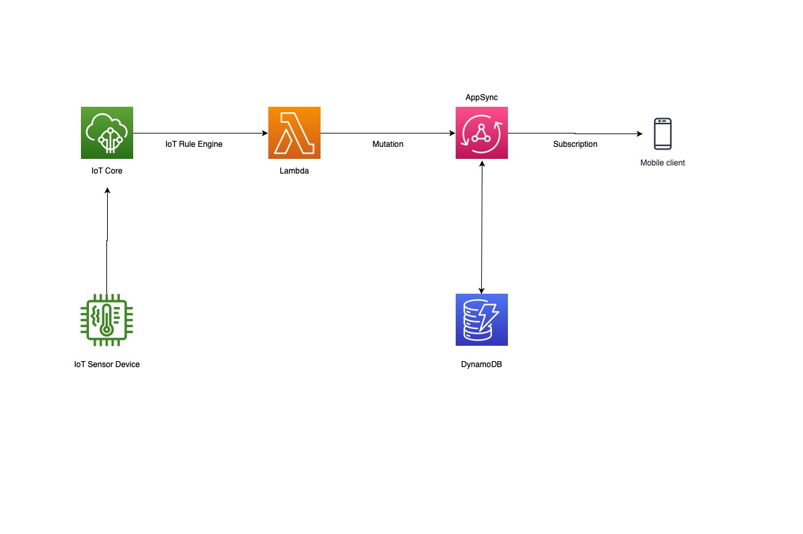

#Introduction
This is an AWS based solution for a real time application where IoT Sensor device publish data to AWS IoT Core and a mobile/webapp client subscribes to the real time updates from sensor using AWS AppSync.

